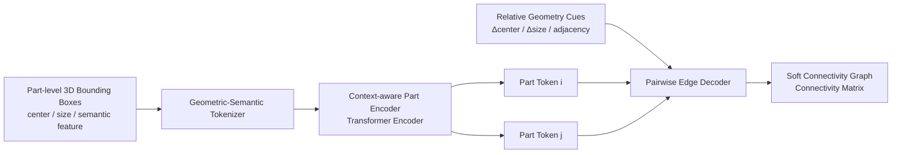

```mermaid
flowchart LR

A[Part-level 3D Bounding Boxes<br/>center / size / semantic feature]
--> B[Geometric-Semantic Tokenizer]

B --> C[Context-aware Part Encoder<br/>Transformer Encoder]

C --> D1[Part Token i]
C --> D2[Part Token j]

E[Relative Geometry Cues<br/>Δcenter / Δsize / adjacency]
--> F[Pairwise Edge Decoder]

D1 --> F
D2 --> F

F --> G[Soft Connectivity Graph<br/>Connectivity Matrix]
```