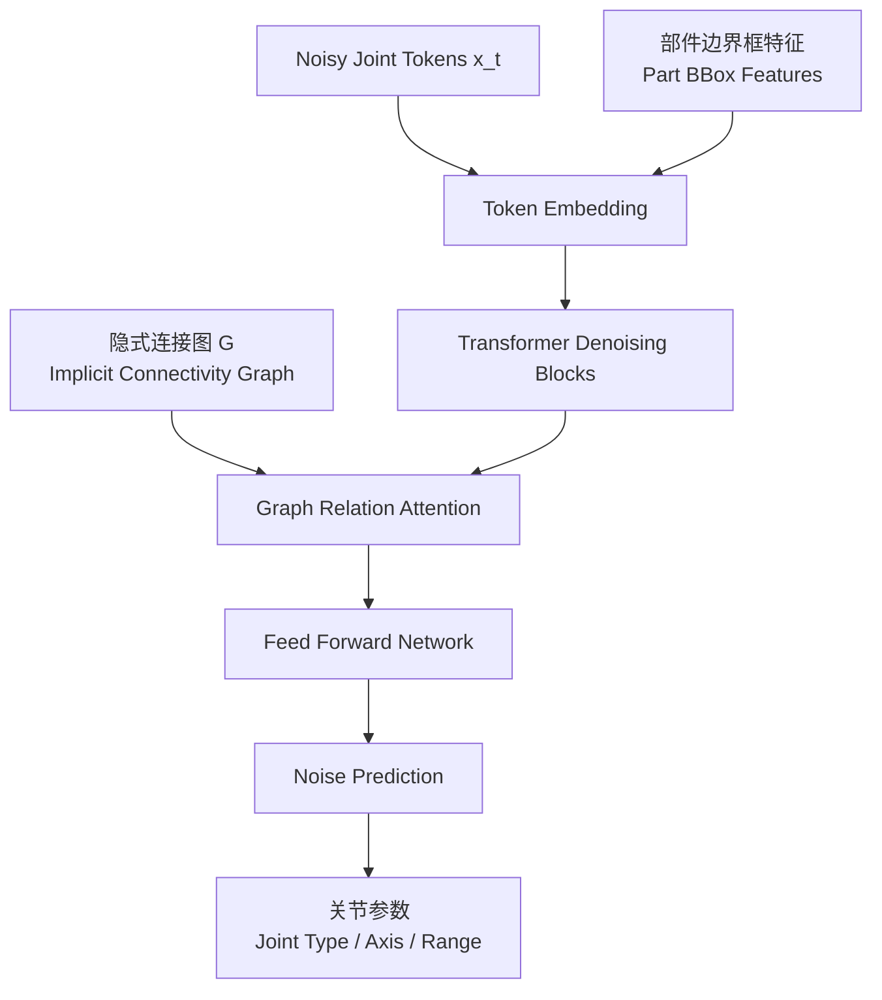

```mermaid
flowchart TD

A[Noisy Joint Tokens x_t] --> B[Token Embedding]

C[部件边界框特征<br/>Part BBox Features] --> B

B --> D[Transformer Denoising Blocks]

G[隐式连接图 G<br/>Implicit Connectivity Graph] --> E[Graph Relation Attention]

D --> E

E --> F[Feed Forward Network]

F --> H[Noise Prediction]

H --> I[关节参数<br/>Joint Type / Axis / Range]
```