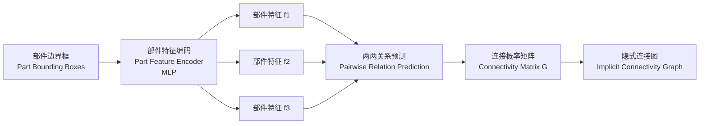

```mermaid
flowchart LR

A[部件边界框<br/>Part Bounding Boxes] --> B[部件特征编码<br/>Part Feature Encoder<br/>MLP]

B --> C1[部件特征 f1]
B --> C2[部件特征 f2]
B --> C3[部件特征 f3]

C1 --> D[两两关系预测<br/>Pairwise Relation Prediction]
C2 --> D
C3 --> D

D --> E[连接概率矩阵<br/>Connectivity Matrix G]

E --> F[隐式连接图<br/>Implicit Connectivity Graph]
  
```